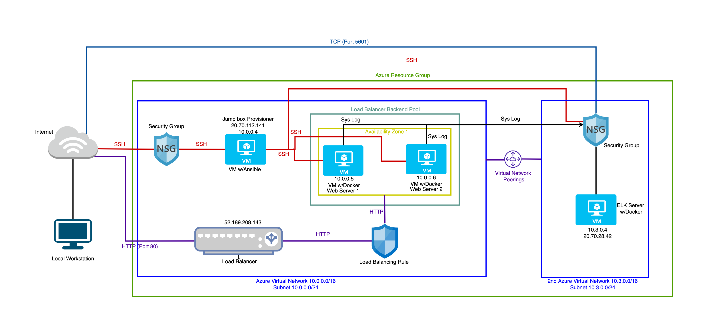
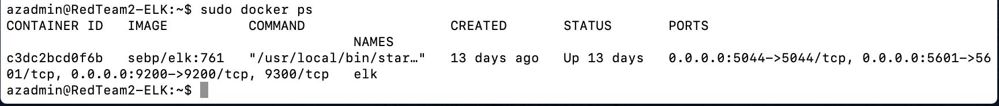

## Automated ELK Stack Deployment

In this project, I configured an ELK stack server in order to set up a cloud monitoring system. This project resulted in tangible deliverables that demonstrate my knowledge of cloud, network security, logging and monitoring.

The files in this repository were used to configure the network depicted below.



These files have been tested and used to generate a live ELK deployment on Azure. They can be used to either recreate the entire deployment pictured above. Alternatively, select portions of the YAML files may be used to install only certain pieces of it, such as Filebeat.

- Here is the playbook for installing ELK server

  ```
  ---
  - name: Configure Elk VM with Docker
    hosts: elk
    remote_user: azadmin
    become: true
    tasks:
      # Use apt module
      - name: Install docker.io
        apt:
          update_cache: yes
          force_apt_get: yes
          name: docker.io
          state: present

      # Use apt module
      - name: Install python3-pip
        apt:
          force_apt_get: yes
          name: python3-pip
          state: present

      # Use pip module (It will default to pip3)
      - name: Install Docker module
        pip:
          name: docker
          state: present

      # Use command module
    # - name: Increase virtual memory
      # command: sysctl -w vm.max_map_count=262144

      # Use sysctl module
      - name: Use more memory
        sysctl:
          name: vm.max_map_count
          value: 262144
          #state: #TODO
          #reload: #TODO

      # Use docker_container module
      - name: download and launch a docker elk container
        docker_container:
          name: elk
          image: sebp/elk:761
          state: started
          restart_policy: always
          # Please list the ports that ELK runs on
          published_ports:
            -  "5601:5601"
            -  "9200:9200"
            -  "5044:5044"

      # Use systemd module
      - name: Enable service docker on boot
        systemd:
          name: docker
          enabled: yes
  ```

This document contains the following details:
- Description of the Topology
- Access Policies
- ELK Configuration
  - Beats in Use
  - Machines Being Monitored
- How to Use the Ansible Build

### Description of the Topology

The main purpose of this network is to expose a load-balanced and monitored instance of DVWA, the D*mn Vulnerable Web Application.

Load balancing ensures that the application will be highly available, in addition to restricting bad traffic and overload to the network.

- Aspect of security that load balancers protect: 
  
  Load Balancing plays an important security role as computing moves evermore to the cloud. Load balancers improve application availability and responsiveness and prevent server overload. The off-loading function of a load balancer defends an organization against distributed denial-of-service (DDoS) attacks.

- Advantage of a jump box:

  A jump box is a secure computer that all admins first connect to before launching any administrative task or use as an origination point to connect to other servers or untrusted environments. So noboby can access the web server VMs directly which strengthens the security of the system. Thus it ensures Automation, Security, Network Segmentation, Access Control.

Integrating an ELK server allows users to easily monitor the vulnerable VMs for changes to the data and system logs.

- Filebeat watches for:

  Filebeat is a lightweight shipper for forwarding and centralizing log data. Installed as an agent on your servers, Filebeat monitors the log files or locations that you specify, collects log events, and forwards them either to Elasticsearch or Logstash for indexing.

- Metricbeat records:

  Metricbeat is a lightweight shipper that you can install on your servers to periodically collect metrics from the operating system and from services running on the server. Metricbeat takes the metrics and statistics that it collects and ships them to the output that you specify, such as Elasticsearch or Logstash. Metricbeat helps you monitor your servers by collecting metrics from the system and services running on the server.

The configuration details of each machine may be found below.

| Name     | Function   | Private IP | Public IP     | Operating System |
|----------|------------|------------|---------------| -----------------|
| Jump Box | Gateway    | 10.0.0.4   | 20.70.112.141 | Linux            |
| Web1     | Web Server | 10.0.0.5   | X             | Linux            |
| Web2     | Web Server | 10.0.0.6   | X             | Linux            |
| ELK      | Monitoring | 10.3.0.4   | 20.70.28.42   | Linux            |


### Access Policies

The machines on the internal network are not exposed to the public Internet. 

Only the ELK Server machine can accept connections from the Internet. TCP Access to this machine is only allowed from the following IP addresses:
- My Workstation Public IP address: 110.140.149.9 over TCP port 5601

Machines within the network can only be accessed by my Workstation and Jump Box Provisioner.

Which machine did you allow to access your ELK VM? What was its IP address?

- Jump Box Provisioner IP Address: 10.0.0.4 over SSH port 22

- My Workstation IP address: 110.140.149.9 over TCP port 5601

A summary of the access policies in place can be found in the table below.

| Name          | Publicly Accessible | Allowed IP Addresses      |
|---------------|---------------------|---------------------------|
| Jump Box      | No                  | 110.140.149.9 on SSH 22   |
| Web1          | No                  | 10.0.0.4 on SSh 22        |
| Web2          | No                  | 10.0.0.4 on SSH 22        |
| ELK           | No                  | 10.0.0.4 on SSH 22        |
| ELK           | No                  | 110.140.149.9 on TCP 5601 |
| Load Balancer | No                  | 110.140.149.9 on HTTP 80  |

### Elk Configuration

Ansible was used to automate configuration of the ELK machine. No configuration was performed manually, which is advantageous because of

- Free: Ansible is an open-source tool.

- Very simple to set up and use: No special coding skills are necessary to use Ansible's playbooks (more on playbooks later).

- Powerful: Ansible lets you model even highly complex IT workflows. 

- Flexible: You can orchestrate the entire application environment no matter where it's deployed. You can also customize it based on your needs.

- Agentless: You don't need to install any other software or firewall ports on the client systems you want to automate. You also don't have to set up a separate management structure.

- Efficient: Because you don't need to install any extra software, there's more room for application resources on your server.

The playbook of installing ELK implements the following tasks:

- Specifiy the VM and remote user

- Install docker.io

- Install python3-pip

- Install Docker module

- Increase virtual memory

- download and launch a docker elk container

- Enable service docker on boot

The following screenshot displays the result of running `docker ps` after successfully configuring the ELK instance.



### Target Machines & Beats
This ELK server is configured to monitor the following machines:

| Name | IP Address |
|------|------------|
| Web1 | 10.0.0.5   |
| Web2 | 10.0.0.6   |

We have installed the following Beats on these machines:
- Filebeat
- Metricbeat

These Beats allow us to collect the following information from each machine:

- Filebeat: It collects data about the file system, such as log events.

- Metricbeat: It collects machine metrics and statistics, such as uptime

### Using the Playbook
In order to use the playbook, you will need to have an Ansible control node already configured. Assuming you have such a control node provisioned: 

SSH into the control node and follow the steps below to install filebeat:

- Copy the playbook file such as /etc/ansible/filebeat-config.yml to /etc/filebeat/filebeat.yml

- Update the hosts file to include two host groups such as webservers and elk. We use webservers host to install the filebeat.

- Run the playbook, and navigate to Kibana (http://20.70.28.42:5601/app/kibana#/home) to check that the installation worked as expected.


- The command to download the playbook is as follows: 

  ```
  curl https://gist.githubusercontent.com/slape/5cc350109583af6cbe577bbcc0710c93/raw/eca603b72586fbe148c11f9c87bf96a63cb25760/Filebeat > /etc/ansible/filebeat-config.yml
  ```

- Update this file as shown below:
  - Scroll to line #1106 and replace the IP address with the IP address of the ELK machine.

  ```
  output.elasticsearch:
  hosts: ["10.3.0.4:9200"]
  username: "elastic"
  password: "changeme"
  ```
  - Scroll to line #1806 and replace the IP address with the IP address of the ELK machine.

  ```
  setup.kibana:
  host: "10.3.0.4:5601"
  ```

The procedure to install Metricbeat is similar to Filebeat. 

### Refence 

1. https://avinetworks.com/what-is-load-balancing/#:~:text=Load%20Balancing%20plays%20an%20important,to%20a%20public%20cloud%20provider.

2. https://www.citrix.com/en-au/solutions/app-delivery-and-security/load-balancing/what-is-load-balancing.html#:~:text=Load%20balancers%20improve%20application%20availability,server%20capable%20of%20fulfilling%20them.

3. https://www.csoonline.com/article/2612700/security-jump-boxes-improve-security-if-you-set-them-up-right.html

4. https://www.elastic.co/guide/en/beats/filebeat/current/filebeat-overview.html#:~:text=Filebeat%20is%20a%20lightweight%20shipper,Elasticsearch%20or%20Logstash%20for%20indexing.

5. https://www.elastic.co/guide/en/beats/metricbeat/current/metricbeat-overview.html#:~:text=Metricbeat%20takes%20the%20metrics%20and,Apache

6. https://www.simplilearn.com/tutorials/ansible-tutorial/what-is-ansible#:~:text=Benefits%20of%20Ansible,-Free%3A%20Ansible%20is&text=Very%20simple%20to%20set%20up,no%20matter%20where%20it's%20deployed.
